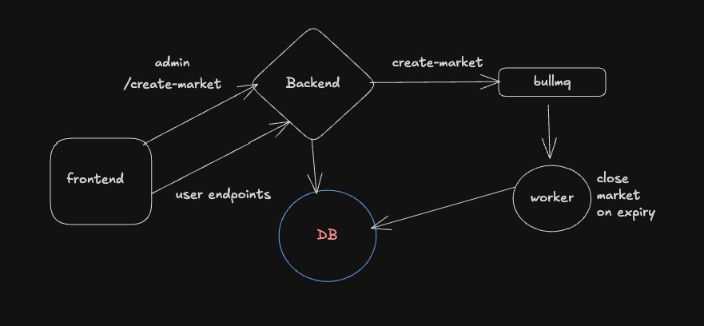
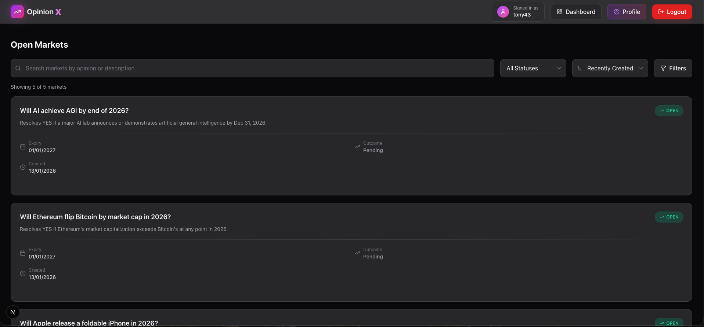
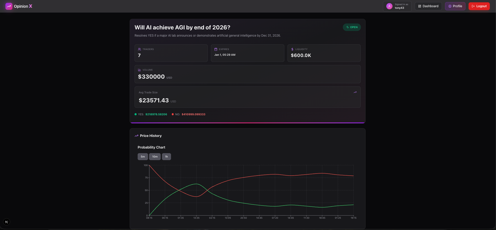
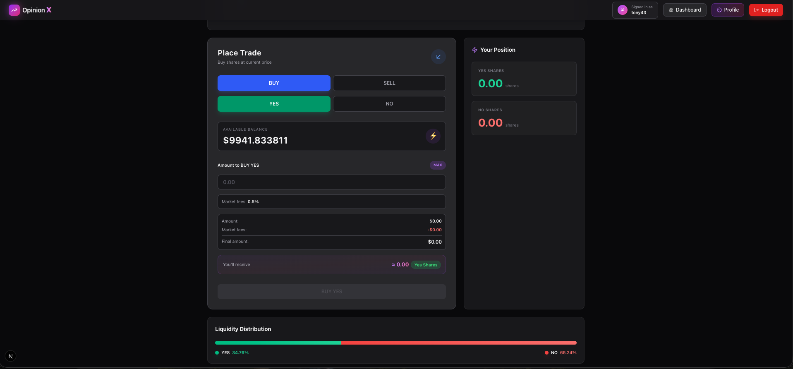
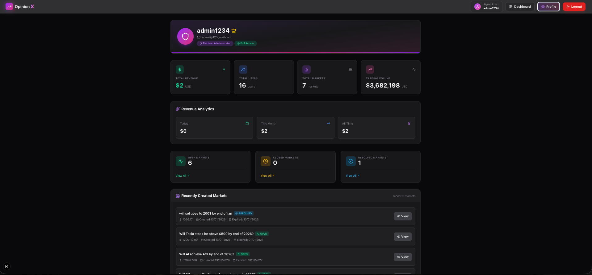

# OpinionX 🧠📈 : Prediction Market Platform

---

## 📖 Overview

**OpinionX** is a full-stack prediction market platform where opinions meet probability. Users can trade **YES / NO shares** on real-world or hypothetical events, with prices dynamically determined using an **Automated Market Maker (AMM)** that reflects collective belief in real time.

Trade on outcomes, track positions, and visualize probability movements through interactive charts—all in a sleek, modern interface.

---

## 🧱 System Architecture

> High-level architecture diagram



---

## 🚀 Features

### 🔮 Prediction Markets
- Create and participate in opinion-based markets
- Trade **YES** / **NO** outcomes on future events
- Time-bound markets with automatic closing mechanisms

### 💱 AMM-Based Trading
- **Constant Product Market Maker** (`YES_POOL × NO_POOL = k`)
- Real-time price & probability calculation
- Slippage-aware buy & sell mechanics
- Dynamic liquidity adjustments

### 📊 Real-Time Insights
- Probability history charts with interval-based tracking
- Trader participation distribution (YES vs NO)
- Market liquidity visualization
- Live market statistics

### 👤 User System
- Secure authentication powered by **NextAuth**
- Personal balance management
- Individual market positions tracking (YES / NO shares)

### 🧾 Trades & Positions
- Market-wide trades feed
- User-specific trade history
- Live position tracking across all markets

### 🏁 Market Resolution & Payouts
- Admin-controlled market resolution
- Automatic payout eligibility checks
- One-click payout claiming for eligible users

---

## 🧠 How OpinionX Works

### 1️⃣ Market Creation
- Each market starts with equal YES and NO liquidity
- Initial probability is derived from pool ratios

### 2️⃣ Trading
- Users buy or sell YES/NO shares
- AMM adjusts pools to maintain constant product
- Prices update instantly based on demand

### 3️⃣ Market Close
- Trading stops at expiry
- Admin resolves the final outcome

### 4️⃣ Payout
- Winning side holders can claim payouts
- Losers receive no payout

---

## 🛠 Tech Stack

### Frontend
- **Next.js** (App Router)
- **TypeScript**
- **Tailwind CSS**
- **TanStack React Query**
- **Recharts**
- **NextAuth**

### Backend
- **Bun**
- **Express**
- **Prisma ORM**
- **PostgreSQL**
- **JWT Authentication**
- **REST APIs**

---

## 📸 Screenshots

### 🏠 Home / Market List


### 📊 Market Details & Chart


### 📊 Trading


### 👤 Admin Profile Page


---

## 🎯 Core API Endpoints

### Markets
- `GET /api/markets` - List all markets
- `GET /api/markets/:id` - Get market details
- `POST /api/markets` - Create a new market (Admin)
- `POST /api/markets/:id/resolve` - Resolve market outcome (Admin)

### Trading
- `POST /api/markets/:id/buy` - Buy YES/NO shares
- `POST /api/markets/:id/sell` - Sell YES/NO shares

### User & Positions
- `GET /api/user/positions` - Get user's current positions
- `GET /api/user/trades` - Fetch trade history
- `POST /api/payout/claim` - Claim payout after market resolution

---

## 📊 Database Schema (Simplified)

- **User**: Authentication & balance
- **Market**: Event details, pools, state
- **Trade**: Buy/sell transactions
- **Position**: User holdings per market
- **Platform Fees**: Platform Fees for admin

---

## 🧮 AMM Formula

```
k = YES_POOL × NO_POOL
price_yes = YES_POOL / (YES_POOL + NO_POOL)
probability_yes = price_yes × 100
```

When a user buys YES shares, the YES pool decreases and NO pool increases, raising the YES price.

---

## 🤝 Contributing

Contributions are welcome!  
Feel free to open issues or submit pull requests.

---

## 📜 License

MIT License

---

**Built with ❤️ by the Pruthviraj**